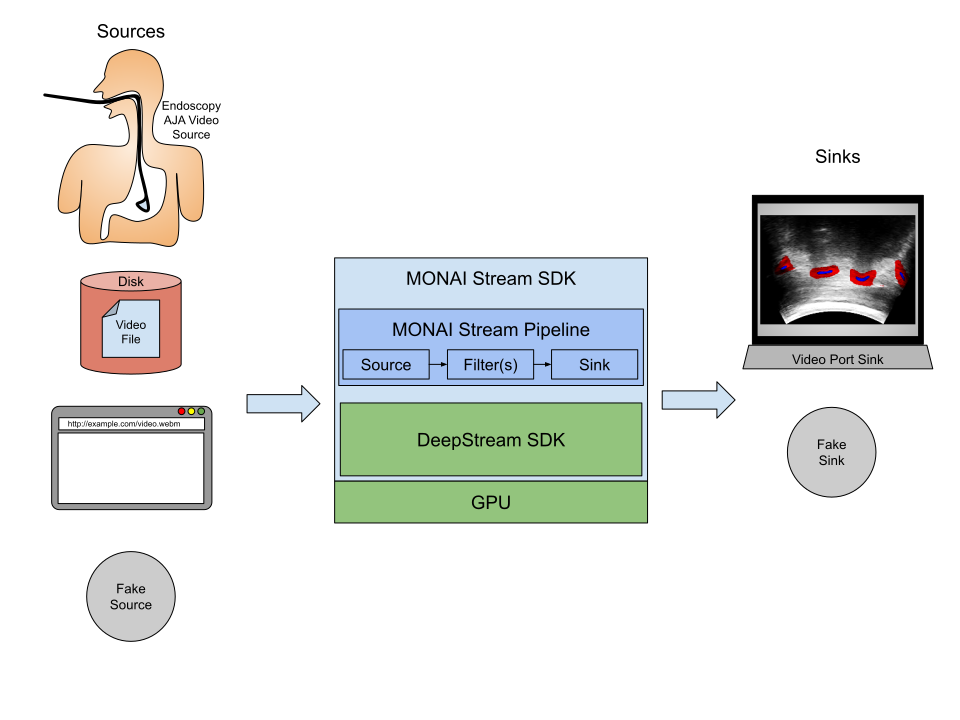

============
MONAI Stream
============

*Medical Open Network for AI*

MONAI Stream SDK aims to equip experienced MONAI Researchers an Developers with the ability to
build streaming inference pipelines on the GPU while enjoying the familiar MONAI development
experience.

Using MONAI Stream SDK developers are able to design and run streaming AI inference pipelines that 
benefit from the performance of GPUs. Users can run streaming inference pipelines both on their workstations
and `Clara AGX <https://developer.nvidia.com/clara-agx-devkit>`_ seamlessly.

MONAI Stream pipelines being with a source component, and end with a sink component,
and the two are connected by a series of filter components as shown below.

MONAI Stream SDK natively supports:

  - a number of input component types including real-time streams (RTSP), streaming URL, local video files,  
    AJA Capture cards with direct memory access to GPU, and a Fake Source for testing purposes
  - outputs components to allow the developer to view the result of their pipelines or just to test via Fake Sink,
  - a number of filter types, including format conversion, video frame resizing and/or scaling, and most importantly a MONAI transform components
    that allows developers to plug-in MONAI transformations into the MONAI Stream pipeline.

The diagram below shows a visualization of a MONAI Stream pipeline where a ``URISource`` is chained to video conversion,
inference service, and importantly to ``TransformChainComponent`` which allows MONAI transformations
(or any compatible callables that accept ``Dict[str, torch.Tensor]``) to be plugged into the MONAI Stream pipeline. The results are then
vizualized on the screen via ``NVEglGlesSink``.

.. mermaid::

   stateDiagram-v2
      URISource (Source) --> NVVideoConvert (Filter)
      NVVideoConvert (Filter) --> NVInferServer (Filter)
      NVInferServer (Filter) --> ConcatItemsd: ORIGINAL_IMAGE
      NVInferServer (Filter) --> Activationsd: MODEL_OUTPUT_O
      Lambdad --> NVEglGlesSink (Sink)

      state TransformChainComponent(Filter) {
         Activationsd --> AsDiscreted
         AsDiscreted --> AsChannelLastd
         AsChannelLastd --> ScaleIntensityd
         ScaleIntensityd --> ConcatItemsd
         ConcatItemsd --> Lambdad
      }

In the conceptual example pipeline above, ``NVInferServer`` passes both the original image
as well as all the inference model outputs to the transform chain component. The developer may 
choose to manipulate the two pieces of data separately or together to create the desired output
for display.

``TransformChainComponent`` presents MONAI transforms 
with ``torch.Tensor`` data containing a single frame of the video stream. 
Implementationally, ``TransformChainComponent`` provides a compatibility layer between MONAI
and the underlying `DeepStream SDK <https://developer.nvidia.com/deepstream-sdk>`_ backbone,
so MONAI developers may be able to plug-in existing MONAI inference code into
DeepStream.

-----------------
Table of Contents
-----------------

.. toctree::
   :maxdepth: 1

   installation
   developerguide
   api

------------
Contributing
------------

For guidance on making a contribution to MONAI, see the `contributing guidelines
<https://github.com/Project-MONAI/MONAILabel/blob/main/CONTRIBUTING.md>`_.

-----
Links
-----

- Website: https://monai.io/
- API documentation: https://docs.monai.io/projects/stream
- Code: https://github.com/Project-MONAI/MONAIStream
- Project tracker: https://github.com/Project-MONAI/MONAIStream/projects
- Issue tracker: https://github.com/Project-MONAI/MONAIStream/issues
- Changelog: https://github.com/Project-MONAI/MONAIStream/blob/master/CHANGELOG.md
- Wiki: https://github.com/Project-MONAI/MONAIStream/wiki
- Test status: https://github.com/Project-MONAI/MONAIStream/actions
- PyPI package: https://pypi.org/project/monaistream/
- Weekly previews: https://pypi.org/project/monaistream-weekly/

------------------
Indices and tables
------------------

* :ref:`genindex`
* :ref:`modindex`
* :ref:`search`
